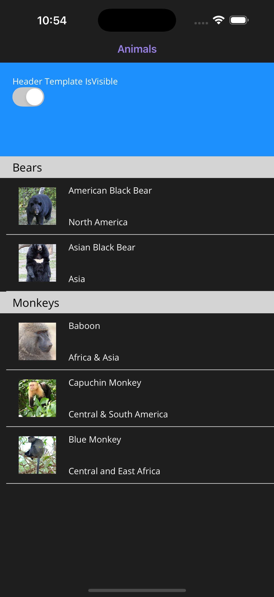
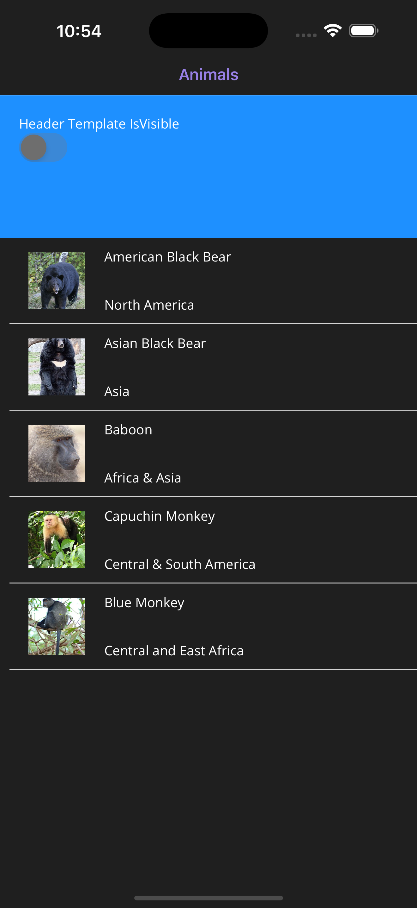
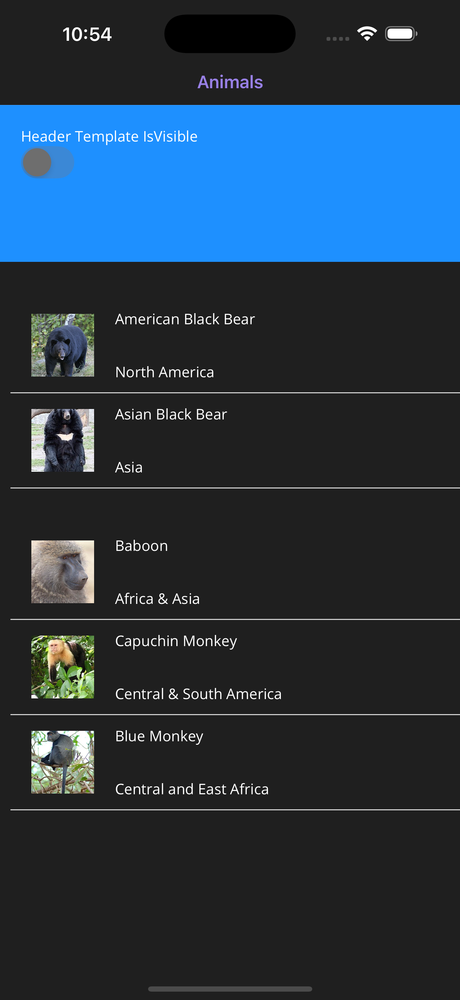

# Collection View Grouped Header Resizing Issue

This project demonstrates how CollectionView does not respect visibility for GroupedHeaderTemplates.

This sample has a very similar setup to the [Display grouped data in a CollectionView](https://learn.microsoft.com/en-us/dotnet/maui/user-interface/controls/collectionview/grouping?view=net-maui-9.0) guide from the official documentation. The only slight changes are my UI models implementing `INotifyPropertyChanged` and the use of `ObservableCollection` instead of `List`.

> Part of my testing in this sample code I've noticed the CollectionView calculates the height of the group header once and that can never change. I tried adding a data trigger with a colour to test that the trigger applied (it did), then tried modifying the height and it would never change. This is likely the same issue affecting the content not being hidden. Notably if you increase the number of items in the collectionview, the group headers change when they get recycled!

## Screenshots

Below are screenshots of the issue, expectation vs reality

| Group Headers Visible                                        | Group Headers Hidden (Expectation)                           | Group Headers Hidden (Reality)                               |
| ------------------------------------------------------------ | ------------------------------------------------------------ | ------------------------------------------------------------ |
|  |  |  |

## Reproduce

- Load the sample on iOS or Android
- Observe the collection view, grouped with headers
- Toggle the switch

**Expected Result**

The group headers dissapear and their cell size is recalculated, the headers should dissapear from the collectionview since they have no header content

**Actual Result**

The group header content dissapears but there is empty space left behind where the header content used to exist.