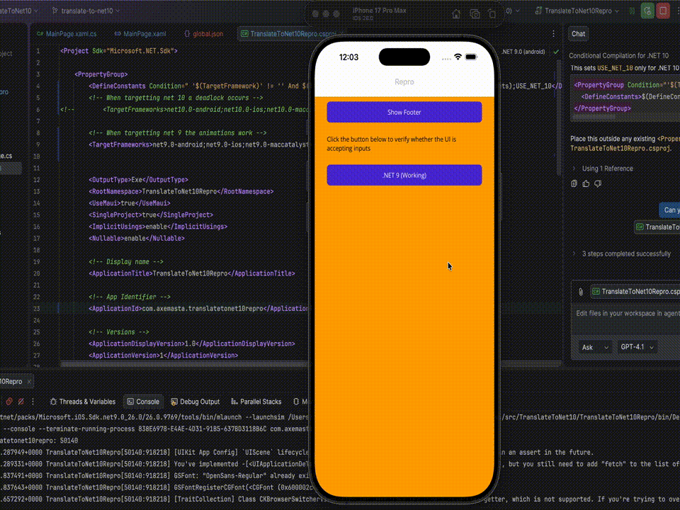
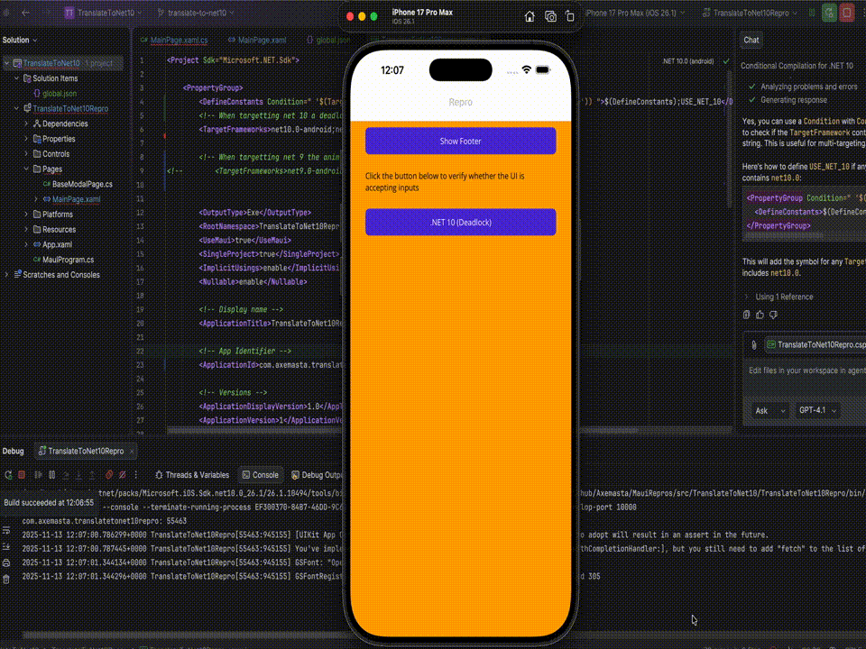

# TranslateToAsync .NET 10 Deadlock

This project contains a reproduction of a UI deadlock caused when using `TranslateToAsync` in .NET10, this is a regression from .NET 9 which does not exhibit this behavior

## Issue

This issue is potentially multi layered as it deals with the iOS layout engine and a custom scenario in my apps.

I have the scenario where a user selects something and I want to show a footer view, similar to a bottom sheet to allow the user to confirm the selection. I have animated the footer view to slide up when appearing and slide down when dissapearing, I have had this in my apps since .NET 7 and it has worked perfectly. After the .NET 10 upgrade I noticed the page would freeze and all UI becomes totally unresponsive, after some investgation I found that my custom `FooterView` is locked in a propety changed death loop where it is constantly changing `Height` & `Y` infinitely.

This issue only appears to affect iOS, I have only tested on Android and it was fine with the .NET10 sample. This sample targets either NET9 or NET10, all you have to do is comment in the relevant target framework in the `.csproj`

### NET 9

Here is the app running on iOS 26.0 with .NET9, it seems to be very happy:

### NET 10

Flip the project to NET10 and the moment you try animating the view, it freezes:

The footer is displayed onscreen but it completely locks up, all UI becomes unresponsive and the animation task never completes. Looking at the debug console I have put prints when a property changes in the footer view and you can see the infinite cycle of property changes.

#### Workarounds

- Ignore the animation (set `useAnimations=false` in the code behind) and just toggle visibility. This is not ideal since we lose our lovely animations!
- Uncomment the `ContentView` footer on `MainPage.xaml` and comment the custom control, this animates perfectly.

## Reproduction Steps

### NET 9

- Open this project
- Ensure the .NET 9 target frameworks are enabled & the .NET10 target frameworks are commented out
- Build & run on iOS (any device)
- Tap "Show Footer" button
- Observe footer view animating on and off the screen hapily

> This is the known working version of 

### NET 10

- Open this project
- Ensure the .NET 10 target frameworks are enabled & the .NET9 target frameworks are commented out
- Build & run on iOS (any device)
- Verify the ".NET 10 (Deadlock)" button responds to clicks (there is no behavior aside from the default iOS animation)
- Tap "Show Footer" button
- Observe the footer displays but the animation does not complete
- Observe no debug message saying "Footer is now shown"
- If you place a breakpoint after the `TranslateToAsync`, it will never get hit as the task never completes

**Expected Result**
The animation behaves as it did on .NET 9

**Actual Result**
The animation task never completes and the UI is deadlocked for the current instance of the app